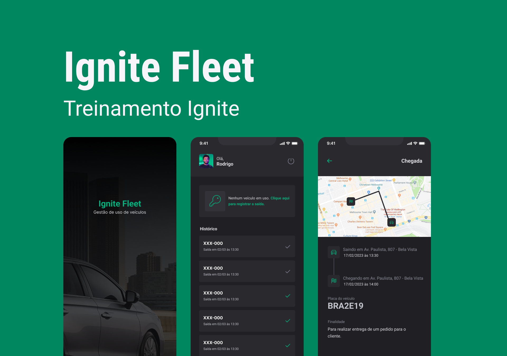
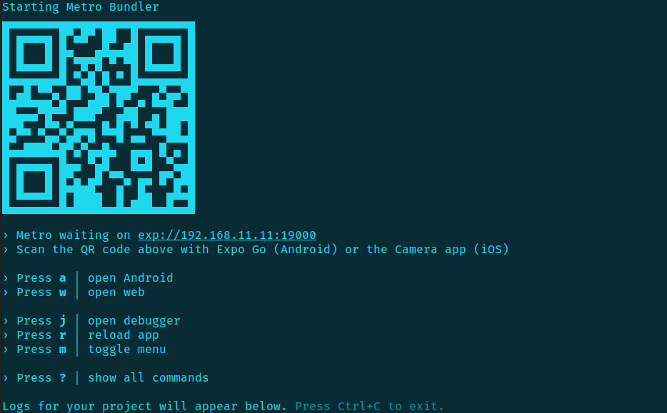
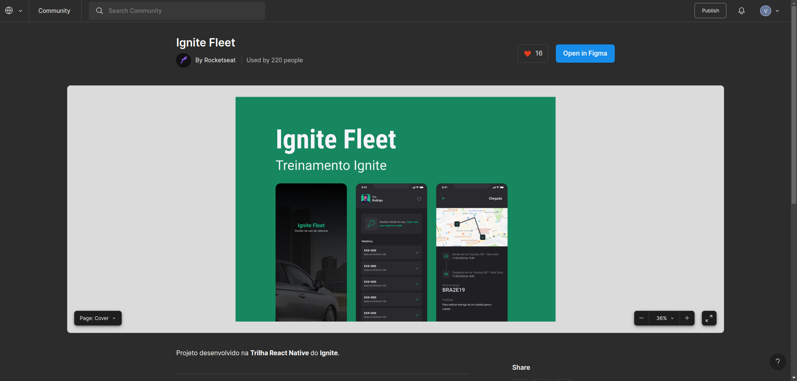

<h1 align="center">
   Ignite Fleet
</h1>

<p align="center">


</p>

---

<p align="center">
  <a href="#-projeto">Projeto</a>&nbsp;&nbsp;&nbsp;|&nbsp;&nbsp;&nbsp;
  <a href="#-como-rodar-o-projeto">Como rodar o projeto</a>&nbsp;&nbsp;&nbsp;|&nbsp;&nbsp;&nbsp;
  <a href="#-tecnologias">Tecnologias</a>&nbsp;&nbsp;&nbsp;|&nbsp;&nbsp;&nbsp;
  <a href="#-layout">Layout</a>&nbsp;&nbsp;&nbsp;|&nbsp;&nbsp;&nbsp;
  <a href="#-licença">Licença</a>
</p>

## 💻 Projeto

O **Ignite Fleet** é um aplicativo de gestão de uso de veículos desenvolvido para colaboradores de uma empresa. Com uma interface intuitiva e recursos eficientes, o aplicativo permite que os usuários registrem o uso de veículos da frota de maneira prática e organizada.

## Funcionalidades

O **Ignite Fleet** oferece as seguintes funcionalidades:

1. **Autenticação Social**: Os usuários podem fazer login no aplicativo de forma rápida e segura usando suas contas do Google.

2. **Registrar a Saída de um Veículo**: Os colaboradores podem registrar facilmente quando utilizam um veículo da empresa. Basta selecionar o veículo desejado e inserir os detalhes relevantes, como data, hora de saída e motivo.

3. **Registrar a Devolução do Veículo**: Ao finalizar a utilização do veículo, os usuários podem registrar a devolução, informando a data e a hora. Isso permite um controle eficiente do tempo de uso de cada veículo.

4. **Histórico dos Registros de Utilização**: O aplicativo mantém um histórico completo de todas as utilizações de veículos registradas pelos colaboradores. Os usuários podem visualizar essas informações de forma clara e ordenada, facilitando a análise e o acompanhamento.

5. **Persistência de Dados Offline**: Mesmo em situações em que não há conexão com a internet, o aplicativo permite que os usuários realizem registros de saída e devolução de veículos. Esses dados são salvos no dispositivo do usuário e são posteriormente sincronizados com o banco de dados quando a conexão é restaurada.

6. **Mapa de Trajeto Percorrido**: Uma funcionalidade adicional do **Ignite Fleet** é exibir no mapa o trajeto percorrido pelo usuário durante a utilização do veículo. Isso proporciona uma visualização clara e georreferenciada das rotas utilizadas.

O **Ignite Fleet** é uma ferramenta indispensável para empresas que desejam otimizar o gerenciamento de sua frota de veículos. Com recursos avançados, como autenticação social, registros de saída e devolução, histórico completo de utilização e persistência de dados offline, o aplicativo oferece uma experiência eficiente e intuitiva aos colaboradores. Não perca tempo e comece a utilizar o **Ignite Fleet** hoje mesmo!

## 🧭 Como rodar o projeto

### 🚨 Requisitos

**Instalação aplicativo do Expo no smartphone**

- [Expo Android](https://play.google.com/store/apps/details?id=host.exp.exponent&hl=pt_BR&gl=US) ou [Expo iOS](https://apps.apple.com/us/app/expo-go/id982107779)

**Clone este repositório**

**Acesse a pasta**

**Instale as dependências e inicie o projeto**

```bash
npm install
```

```bash
npx expo start
```

**Abra o projeto no dispositivo**

Abra o aplicativo do Expo no smartphone, aponte a câmera para o QRCode que apareceu no terminal após executar o comando `npx expo start`.

**Importante**: _O dispositivo móvel e o computador precisam estar na mesma rede_



## 🚀 Tecnologias

Esse projeto foi desenvolvido com as seguintes tecnologias:

- [Expo](https://expo.dev/)
- [TypeScript](https://www.typescriptlang.org/pt/)

## 🔖 Layout

Você pode visualizar o layout do projeto através [deste link](hhttps://www.figma.com/community/file/1233747170984378974/Ignite-Fleet).

<a href="hhttps://www.figma.com/community/file/1233747170984378974/Ignite-Fleet">
  
</a>

## 📝 Licença

Esse projeto está sob a licença MIT. Veja o arquivo [LICENSE](LICENSE) para mais detalhes.
